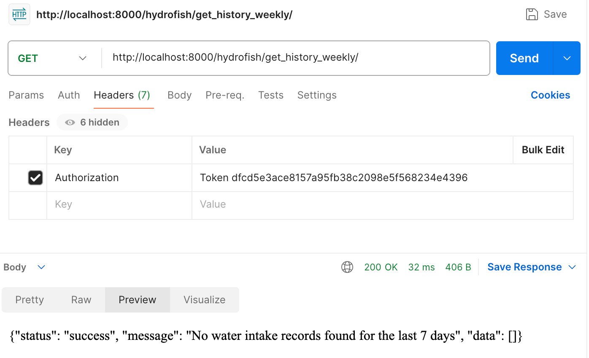
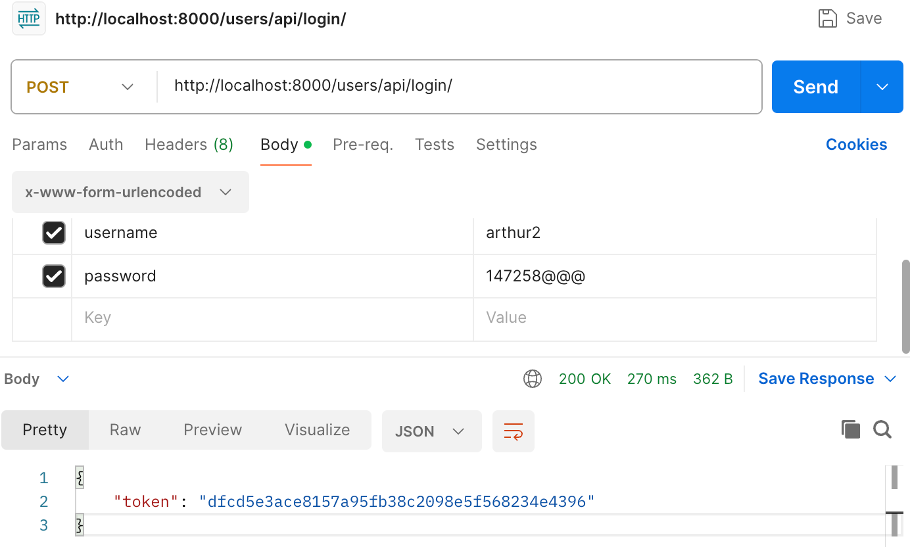
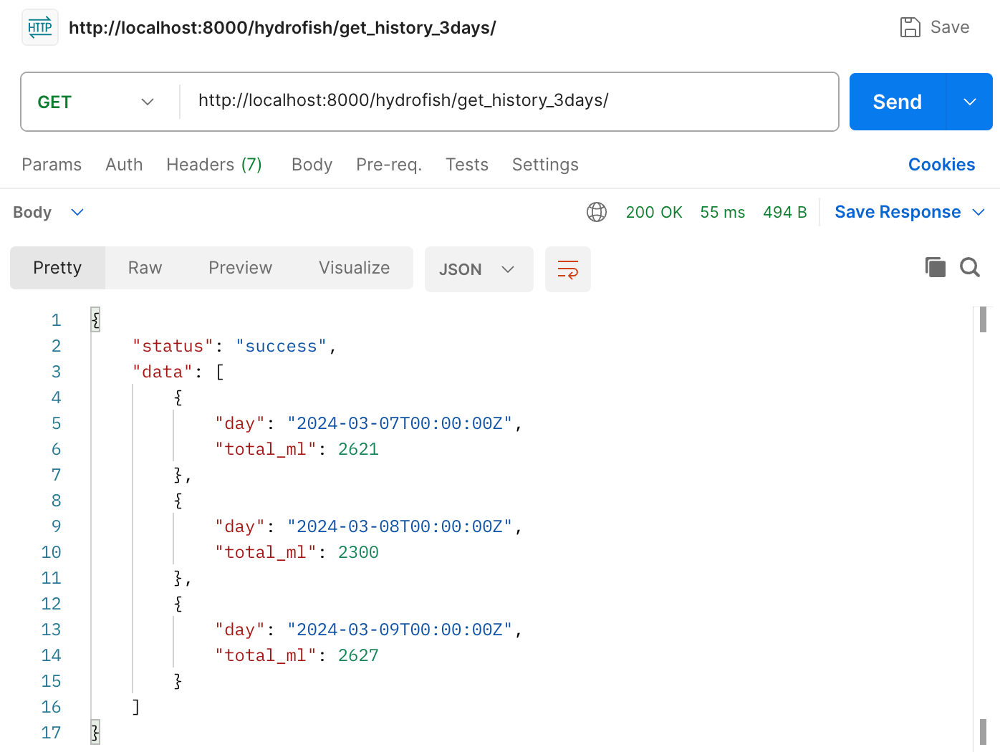
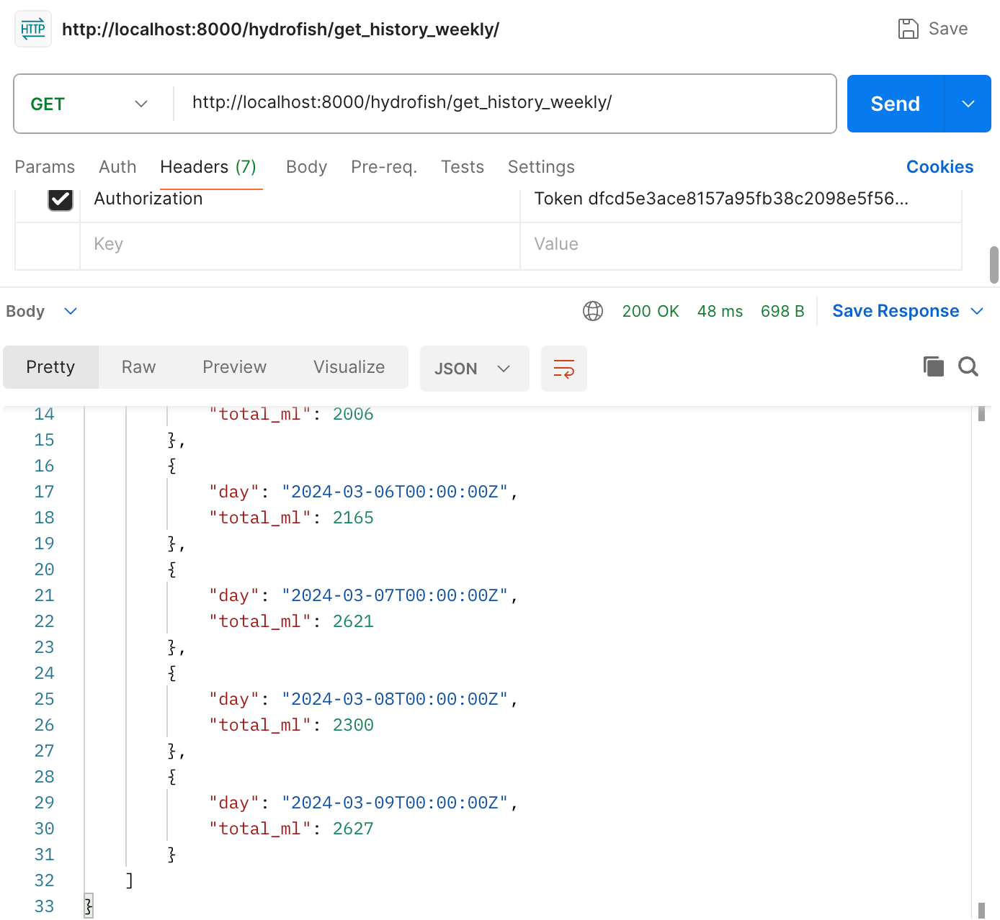
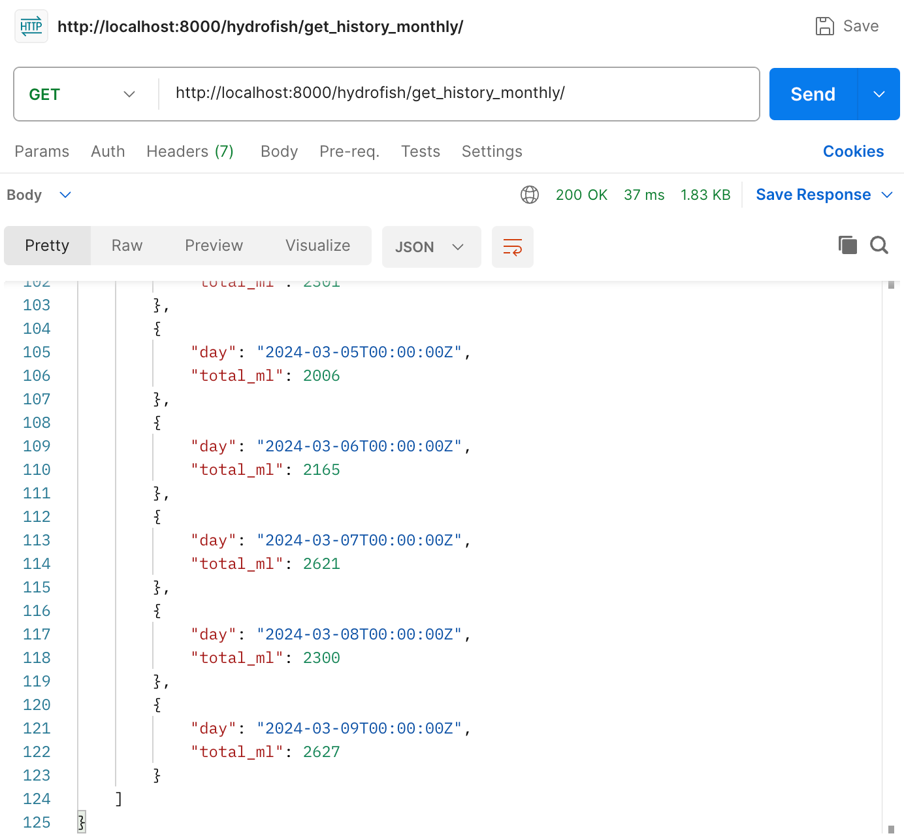

# How to generate date in the library 


Run this Django python command in the backend (where the `manage.py` file lies):
```
$ python manage.py generate_water_intake_data
```
It will return this if everything is ok.
```
Successfully generated water intake data for one month.
```

# Use Postman to test it

| Topic | Picture|
|:---|---|
|If there is **NO history data** in the database <br> It will return message as this.| |
| You have to **login before getting any data**, first is to get the **token**.| |
| Get 3-days history data <br> Remember to put the token in Header| |
|Get weekly (7days) history data  <br> Remember to put the token in Header| |
|Get monthly (30days) history data  <br> Remember to put the token in Header| |